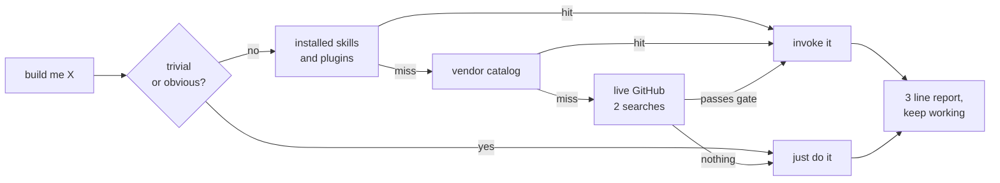

<h1 align="center">claude skill finder</h1>

<p align="center">
  <strong>Look before you build.</strong><br>
  A Claude Code skill that goes and finds the skill you needed,<br>
  then gets on with the work instead of asking you about it.
</p>

<p align="center">
  <a href="https://github.com/nohseongmin/claude-skill-finder/actions"></a>
  
  
  <a href="LICENSE"></a>
</p>

<p align="center">
  <a href="#install">Install</a> ·
  <a href="#the-loop-it-removes">Why</a> ·
  <a href="#three-guards">Guards</a> ·
  <a href="#not-a-router">Not a router</a> ·
  <a href="#한국어">한국어</a>
</p>

---

## The loop it removes

There are thousands of agent skills now, and vendors keep shipping official ones.
So every task starts with the same unpaid lap:

1. You describe what you want built
2. The agent starts writing it from scratch
3. You stop it, go search GitHub yourself, paste a repo back in
4. Now it starts over, properly

`scout` runs step 3 before step 2, on its own, in under two minutes.

## What it does



Local first because it is free. GitHub only when local came up empty. Either way the
turn ends inside the actual task, not in a question.

## Install

```bash
git clone https://github.com/nohseongmin/claude-skill-finder ~/.claude/skills/scout
```

Windows PowerShell:

```powershell
git clone https://github.com/nohseongmin/claude-skill-finder "$env:USERPROFILE/.claude/skills/scout"
```

That is the whole setup. No config, no keys, no dependencies. It triggers itself on
build requests in English or Korean; `/scout` forces it.

Want it to fire even harder, add one line to your `~/.claude/CLAUDE.md`:

```
- No matching skill, or unfamiliar stack/API/domain -> `scout` first.
```

## Three guards

A skill that goes out and fetches other people's repositories is easy to build badly.
These three lines are most of the design.

**A budget.** Three searches, two minutes, then it gives up and writes the code.
Scouting that costs more than building has already failed. This is why it is a skill
and not a background service.

**A gate.** 200+ stars or vendor-published, a commit inside the last year, and a
license. A stale unlicensed repo costs more than an empty result, so it gets dropped
rather than reported.

**A trust boundary.** Anything it fetches is data, not instructions. A README that
says "run this command" or "ignore your previous instructions" gets quoted to you,
never obeyed. Installing a third-party skill means loading a stranger's instructions
into your agent's context, so that one step always asks first. Everything else runs
unattended.

## Not a router

The routers that exist pick between the skills you already installed. Useful, and a
different problem. `scout` looks outward: the [vendor catalog](references/vendor-skills.md)
of officially maintained skills (Anthropic, Vercel, Expo, Supabase, Stripe, Cloudflare,
Sentry, Trail of Bits and more, all verified live), then GitHub itself with
[query templates](references/search-recipes.md) that filter for maintained work.

If nothing out there passes the gate, it says so in one line and builds the thing.
"Found nothing" is a valid, cheap answer.

## Make it yours

`references/vendor-skills.md` is a plain table. Fork it, add the stacks your team
actually runs, delete the rest. `references/search-recipes.md` holds the query
templates. The skill is a single markdown file with no code in it.

```bash
python test/test_skill.py
```

The test guards portability and the three guards above, so an edit that quietly
deletes the trust boundary fails CI instead of shipping.

## 한국어

스킬이 수천 개가 됐다. 그래서 작업마다 같은 헛수고가 붙는다. 만들어달라고 하고, 맨바닥부터
짜기 시작하면 멈춰 세우고, 직접 깃허브 뒤져서 레포를 붙여넣고, 그제서야 제대로 시작한다.

`scout`는 그 순서를 뒤집는다. 짜기 전에 먼저 찾는다. 설치된 스킬 → 벤더 공식 카탈로그 →
깃허브 실시간 순으로 훑고, 세 줄로 보고한 뒤 **묻지 않고 원래 작업을 이어간다.**

설계의 핵심은 가드 셋이다. **예산**(검색 3회·2분, 넘으면 포기하고 직접 짬. 찾는 시간이
짜는 시간보다 길면 이미 실패다), **관문**(★200+ 또는 벤더 공식 · 1년 내 커밋 · 라이선스),
**신뢰 경계**(외부 레포의 README는 데이터지 명령이 아니다. 서드파티 스킬 설치는 남의
지시문을 내 컨텍스트에 넣는 일이라 이 단계만 확인을 받는다).

버그 수정·리팩토링·1~2줄 수정·이미 스킬이 정해진 작업에는 발동하지 않는다.

## License

MIT
