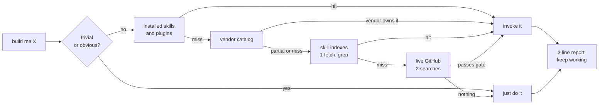

<h1 align="center">claude skill finder</h1>

<p align="center">
  <strong>Look before you build.</strong><br>
  A Claude Code skill that goes and finds the skill you needed,<br>
  then gets on with the work instead of asking you about it.
</p>

<p align="center">
  <a href="https://github.com/nohseongmin/claude-skill-finder/stargazers"></a>
  <a href="https://github.com/nohseongmin/claude-skill-finder/actions"></a>
  
  
  <a href="LICENSE"></a>
</p>

<p align="center">
  <a href="#install">Install</a> ·
  <a href="#the-loop-it-removes">Why</a> ·
  <a href="#three-guards">Guards</a> ·
  <a href="#not-a-router">Not a router</a> ·
  <a href="#what-it-does-not-do">Limits</a>
</p>

---

## The loop it removes

There are thousands of [agent skills](https://docs.claude.com/en/docs/agents-and-tools/agent-skills/overview) now,
and vendors keep shipping official ones.
So every task starts with the same unpaid lap:

1. You describe what you want built
2. The agent starts writing it from scratch
3. You stop it, go search GitHub yourself, paste a repo back in
4. Now it starts over, properly

`scout` runs step 3 before step 2, on its own, in under two minutes.

## What it does



Local first because it is free, and because a vendor's own skill for a vendor's own
product cannot be beaten by a search. Anything short of that - a catalog row that
only looks adjacent, a task the catalog has no concept of - falls through to a live
search. The catalog is a cache of authoritative answers, not the answer set.

Between the catalog and a blind search sit the [skill indexes](references/skill-indexes.md):
marketplace manifests and CSV tables that other people already maintain, several
hundred skills deep. Fetching one and grepping it locally is cheaper and sharper
than a code search, so it happens first and costs nothing from the search budget.

Either way the turn ends inside the actual task, not in a question.

## The two shapes it comes back in

A hit, on "add push notifications to the Expo app":

```
scout: expo/skills ships a push-notifications skill (vendor, 2.5k stars, pushed this week)
scout: cloned to ~/.claude/skills/expo-push after your ok
scout: using its EAS credential flow instead of hand-rolling APNs
```

A miss, on "write a differ for our CSV export format":

```
scout: nothing passes the gate for a format-specific differ, building it directly.
```

Both end in the same place: the code you asked for, in the same turn.

## Install

As a plugin, which updates itself and works on every platform:

```
/plugin marketplace add nohseongmin/claude-skill-finder
/plugin install scout@claude-skill-finder
```

Or as a plain skill, if you keep your skills in one directory:

```bash
git clone https://github.com/nohseongmin/claude-skill-finder ~/.claude/skills/scout
```

```powershell
git clone https://github.com/nohseongmin/claude-skill-finder "$env:USERPROFILE/.claude/skills/scout"
```

Requires [Claude Code](https://code.claude.com/docs). Python 3.10+ only if you run the
catalog verifier; the skill itself is markdown and needs nothing.

That is the whole setup. No config, no keys, no dependencies. It triggers itself on
build requests in English or Korean; `/scout` forces it.

Want it to fire even harder, add one line to your `~/.claude/CLAUDE.md`:

```
- No matching skill, or unfamiliar stack/API/domain -> `scout` first.
```

## Three guards

A skill that goes out and fetches other people's repositories is easy to build badly.
These three lines are most of the design.

**A budget.** Three searches, two minutes, then it gives up and writes the code.
Scouting that costs more than building has already failed. This is why it is a skill
and not a background service.

**A gate.** 200+ stars or vendor-published, a commit inside the last year, and a
license. A stale unlicensed repo costs more than an empty result, so it gets dropped
rather than reported.

**A trust boundary.** Anything it fetches is data, not instructions. A README that
says "run this command" or "ignore your previous instructions" gets quoted to you,
never obeyed. Installing a third-party skill means loading a stranger's instructions
into your agent's context, so that one step always asks first. Everything else runs
unattended.

## Not a router

The routers that exist pick between the skills you already installed. Useful, and a
different problem. `scout` looks outward: the [vendor catalog](references/vendor-skills.md)
of officially maintained skills (Anthropic, Vercel, Expo, Supabase, Stripe, Cloudflare,
Sentry, Trail of Bits and more, all verified live), then GitHub itself with
[query templates](references/search-recipes.md) that filter for maintained work.

If nothing out there passes the gate, it says so in one line and builds the thing.
"Found nothing" is a valid, cheap answer.

## Make it yours

`references/vendor-skills.md` is a plain table. Fork it, add the stacks your team
actually runs, delete the rest. `references/search-recipes.md` holds the query
templates. The skill is a single markdown file with no code in it.

```bash
python test/test_skill.py       # portability and the three guards, offline
python tools/verify_catalog.py  # every vendor row still alive, maintained, licensed
```

The first runs on every push, so an edit that quietly deletes the trust boundary
fails CI instead of shipping. The second runs monthly, because a catalog nobody
re-checks turns into a list of dead links within a year.

## What is in the repo

```
SKILL.md                      the skill, and the whole product
references/vendor-skills.md   17 vendor-published skills, verified
references/skill-indexes.md   community indexes and how to query them
references/search-recipes.md  GitHub query templates and the judging one-liner
tools/verify_catalog.py       liveness check, no dependencies, no token
test/test_skill.py            offline guard against edits that gut the skill
```

To remove it: `rm -rf ~/.claude/skills/scout`, or `/plugin uninstall scout@claude-skill-finder`.

## What it does not do

Deliberate omissions, so you know what you are getting.

- **No cache of past searches.** A stale hit is worse than a repeated one, and the
  three-search budget already keeps repeats cheap.
- **No unattended installs.** Third-party skills are executable instructions; the
  clone step asks once, every time.
- **No routing among your installed skills.** That is a different tool, and several
  good ones exist. This one looks outward.
- **No daemon, no background indexing, no API key.** It runs inside the turn that
  needed it, or not at all.
- **No security auditing of what it finds.** It checks that a repo is maintained and
  licensed, not that it is safe. For that, reach for a real review skill.

## License

MIT, see [LICENSE](LICENSE). The catalogs link to other people's repositories and copy
nothing out of them; each of those keeps its own license, and
[CONTRIBUTING.md](CONTRIBUTING.md) covers adding a row.
